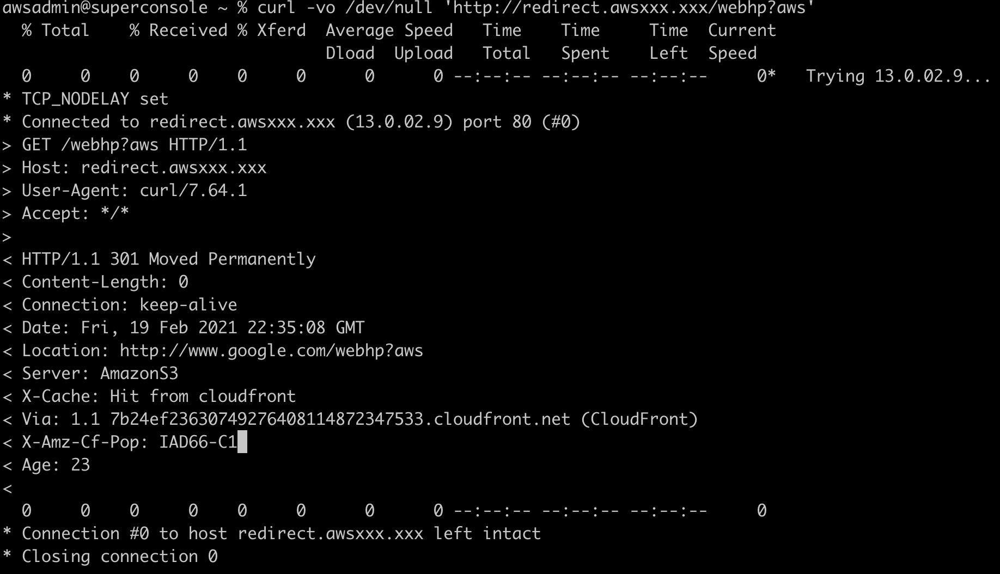

# aws-s3-redirects
Redirect from one DNS to another using S3 redirection with Cloudfront and Amazon Route 53

## AWS Services used
- [Amazon S3](https://aws.amazon.com/s3/)
- [Amazon Cloudfront](https://aws.amazon.com/cloudfront/)
- [Amazon Route53](https://aws.amazon.com/route53/)

## Steps:

* Creating the Amazon S3 bucket
* Create Amazon Cloudfront distribution
* Create Amazon Route 53 record in your hosted zone
* Test you DNS

### Creating the Amazon S3 bucket

1. In the console go to S3 Service [https://s3.console.aws.amazon.com/s3](https://s3.console.aws.amazon.com/s3)

2. Create a bucket with the following settings:
	- Name: `<bucket_name_redirect>` #_for example www.mysite-redirect.com_
  	- Block all public access: `Uncheck it`
  	- Tick the `I acknowledge that the current settings...` option.
  	- You can leave the rest of the optiones as default.
  	- Click on the **Save** button to create the bucket.

### Configure the Amazon S3 bucket

1. Click on the Bucket name recently created to set up the **redirect** configuration.

2. Once you are in the bucket, go to **Properties** tab and scroll down to **Static website hosting** section, Click on **Edit** button.

3. In **Edit static website hosting** page select:
	- Static website hosting: `Enable`
	- Select: Redirect requests for an object
	- Host name: `provide host name to redirect` #_for example www.google.com_
	- Protocol - Optional: `none`
	- Click on **Save Changes**

4. In **Properties** tab of the bucket scroll down again to **Static website hosting** section and copy and save the **Bucket website endpoint**. In my case: `http://www.mysiteredirect.com.s3-website-us-east-1.amazonaws.com`
5. **Done!** Our S3 Bucket is created and configured to redirect our requests using the endpoint you just have copied.

### Create Amazon Cloudfront distribution

1. Go to Amazon Cloudfront service page [https://console.aws.amazon.com/cloudfront](https://console.aws.amazon.com/cloudfront) and click on **Create Distribution** button.
 
2. Click on **Get started** button.

3. In **Create distribution** page, fill in:
	- In **Origin Settings** section:
		- **Origin Domain Name**: `www.mysiteredirect.com.s3-website-us-east-1.amazonaws.com` Paste the **url** copied from the _S3 Static web hosting_ redirect option **WITHOUT** `http://`
	
 		> **Remember:** Paste just the URL without the `http://`part
 		
 		- Leave everything else as default.

 	- In **Distribution Settings** section:
 		- **Alternate Domain Names (CNAMEs)**: Fill with your DNS `redirect.awslego.click`
 		- **SSL Certificate**: Select `Custom SSL Certificate (example.com)` _Select your certificate from the list_
	- `Everything else can be left as default`
	- Finally click on **Create distribution** button.
 

### Create Amazon Route 53 record in your hosted zone

1. Go to Amazon Route53 service page [https://console.aws.amazon.com/route53/v2](https://console.aws.amazon.com/route53/v2) and click on left menu **Hosted zones** link.
 
2. Click on your hosted zone:
 
3. Click on **Create record** button.

4. In **Quick create record** page fill out:
	- **Record name**: `redirect` #_type the name of the record you want to use_
	- **Record type**: A – Routes traffic to an IPv4 address and some AWS resources
	- **Route traffic to**: 
		- Select: **Alias to Cloudfront distribution**
		- `You region` The region you are using
		- `xxxxxxxxxx9xhh.cloudfront.net` your distribution name

	
	- Click on **Create record** button.

### Test your DNS redirection
1. Use your new DNS record to verify whether DNS+Cloudfront+S3 are doing the redirection.
	- Sample code: `curl -vo /dev/null 'http://redirect.awsxxx.xxx/webhp?aws'`

	 

2. As you can see the request is now in google.com